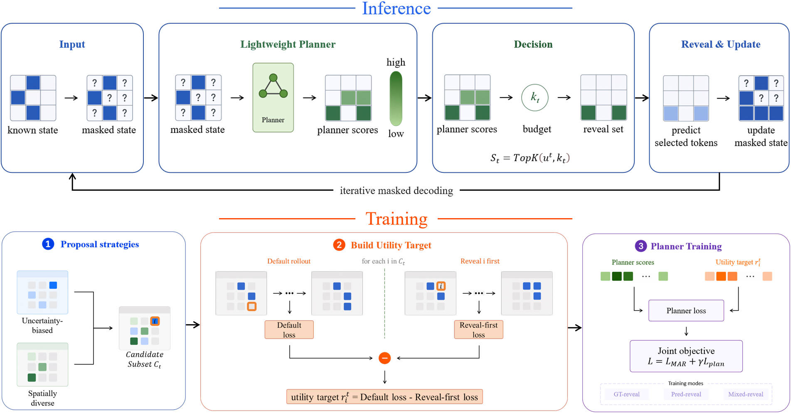

# PlanMAR-S

PlanMAR-S extends masked autoregressive image generation with a lightweight planner for reveal-set selection. During training, the planner receives a one-step reference-policy-conditioned mixed-reveal pseudo utility target. During inference, the learned planner ranks currently masked latent tokens and selects the next reveal set under a score-derived soft budget. The original MAR sampling path remains available as the baseline.



This release provides the formal server-side main-result reproduction workflow and additional MAR-Base control/ablation scripts for Table 2, Table 4, and Table 5 of the paper. The main workflow covers MAR-Base and MAR-Large comparisons. The additional scripts cover fine-tuning control, ranking-budget ablation, and pseudo-target ablation on MAR-Base.

## Installation

```bash
conda env create -f environment.yaml
conda activate <environment-name>
```

Install a PyTorch/CUDA build appropriate for the target multi-GPU server.

## Required External Assets

External assets are not included in this repository.

### ImageNet-1K

The formal experiments use ImageNet-1K in image-folder format. The expected layout is:

```text
/path/to/imagenet/
  train/
  val/
```

ImageNet access link:

- Official ImageNet download page: https://www.image-net.org/download.php

Please follow the corresponding dataset license and access requirements.

### Pretrained MAR Checkpoints

Pretrained MAR checkpoints should be placed under a directory such as:

```text
/path/to/pretrained_models/
  mar/
    mar_base/
      checkpoint-last.pth
    mar_large/
      checkpoint-last.pth
```

The original MAR repository provides instructions and pretrained model references:

```text
https://github.com/LTH14/mar
```

### KL-16 VAE Checkpoint

The KL-16 VAE checkpoint should be placed under a directory such as:

```text
/path/to/pretrained_models/
  vae/
    kl16.ckpt
```

A KL-16 checkpoint can be downloaded from:

```text
https://www.dropbox.com/scl/fi/hhmuvaiacrarfg28qxhwz/kl16.ckpt?rlkey=l44xipsezc8atcffdp4q7mwmh&dl=0
```

If downloading from the command line, users may need to change `dl=0` to `dl=1` depending on the download tool. Please follow the license and usage terms associated with the checkpoint.

### FID / Inception Statistics

The tracked file

```text
fid_stats/adm_in256_stats.npz
```

is used for ImageNet 256×256 FID evaluation if permitted by the release policy. Otherwise, prepare the corresponding ImageNet 256×256 statistics file and place it under `fid_stats/`.

## Configure Server Paths

Edit `scripts_server/common_env.sh` or override these variables:

```bash
export CODE_DIR=/path/to/RevealMAR
export DATA_ROOT=/path/to/imagenet
export PRETRAIN_ROOT=/path/to/pretrained_models
export OUTPUT_ROOT=/path/to/output/planmar_main
export CONDA_SH=/path/to/miniconda3/etc/profile.d/conda.sh
```

The expected pretrained checkpoint layout is:

```text
${PRETRAIN_ROOT}/
  mar/
    mar_base/
      checkpoint-last.pth
    mar_large/
      checkpoint-last.pth
  vae/
    kl16.ckpt
```

Before running formal jobs, check the server environment:

```bash
bash scripts_server/check_server_ready.sh
```

## Main Training Recipe

The main PlanMAR-S training recipe uses:

```text
pseudo_target_type          = ref_mixed_reveal
ref_target_horizon         = 1
ref_target_loss            = feature_mse
ref_target_local_radius    = 1
ref_target_max_candidates  = 8
candidate_pool_size        = 8
candidate_selection_mode   = mixed
planner_loss_weight        = 1.0
ref_target_mix_alpha       = 0.5
mixed_policy_ratio         = 0.0
```

This corresponds to the one-step reference-policy-conditioned mixed-reveal target. Mixed-policy exposure is disabled in the main recipe by setting `MIXED_POLICY_RATIO=0.0`.

## Verified Main-Result Workflow

### Base Workflow

The verified Base run path is:

```bash
AUTO_SHUTDOWN=1 \
USE_TORCHRUN=1 NPROC_PER_NODE=8 \
TRAIN_BSZ=96 \
TRAIN_EPOCHS=7 WARMUP_EPOCHS=1 TRAIN_MAX_STEPS=-1 TRAIN_RUN_NAME=train_ref_mixed_7ep \
MIXED_POLICY_RATIO=0.0 \
EVAL_RUN_NAME=eval_mainpaper EVAL_NUM_IMAGES=50000 EVAL_BSZ=128 EVAL_POLICIES=baseline,planner EVAL_NUM_ITERS=128,256 EVAL_GPU_IDS=0,1,2,3 \
nohup bash scripts_server/run_base_train_then_parallel_eval.sh \
> /path/to/output/base_mainpaper_7ep_8gpu.log 2>&1 &
```

### Large Workflow

The Large workflow follows the same training/evaluation structure. Because the Large backbone is more memory-intensive, a more conservative batch size is recommended by default:

```bash
AUTO_SHUTDOWN=1 \
USE_TORCHRUN=1 NPROC_PER_NODE=8 \
TRAIN_BSZ=64 \
TRAIN_EPOCHS=7 WARMUP_EPOCHS=1 TRAIN_MAX_STEPS=-1 TRAIN_RUN_NAME=train_ref_mixed_7ep \
MIXED_POLICY_RATIO=0.0 \
EVAL_RUN_NAME=eval_mainpaper EVAL_NUM_IMAGES=50000 EVAL_BSZ=64 EVAL_POLICIES=baseline,planner EVAL_NUM_ITERS=128,256 EVAL_GPU_IDS=0,1,2,3 \
nohup bash scripts_server/run_large_train_then_parallel_eval.sh \
> /path/to/output/large_mainpaper_7ep_8gpu.log 2>&1 &
```

Notes:

- These are the verified formal server workflows for the main comparison.
- `EVAL_NUM_ITERS=128,256` restricts evaluation to the main-paper four points.
- The evaluation script names contain `6points` for historical compatibility; `EVAL_NUM_ITERS` controls which decoding steps are actually evaluated.
- The formal main-result reproduction uses baseline/planner evaluation at 128 and 256 decoding steps.
- Use `NPROC_PER_NODE=7` instead of `8` on a seven-GPU server.
- For the Large workflow, increase `TRAIN_BSZ` or `EVAL_BSZ` only after confirming memory safety on the target hardware.

## Additional Paper Controls and Ablations

The following scripts reproduce the MAR-Base control and ablation settings reported in the paper.

These scripts assume that the main Base PlanMAR-S checkpoint has already been trained under:

```text
${OUTPUT_ROOT}/base/train_ref_mixed_7ep/checkpoint-last.pth
```

unless otherwise specified.

### Table 2: Fine-Tuning and Planner-Decoding Control

This script evaluates the following MAR-Base 128-step settings:

```text
Original MAR checkpoint + cosine schedule + cosine budget
PlanMAR-S fine-tuned checkpoint + cosine schedule + cosine budget
PlanMAR-S fine-tuned checkpoint + planner ranking + cosine budget
PlanMAR-S fine-tuned checkpoint + planner ranking + score-derived budget
```

Run:

```bash
TRAIN_RUN_NAME=train_ref_mixed_7ep \
EVAL_RUN_NAME=eval_table2_control \
EVAL_NUM_IMAGES=50000 \
EVAL_BSZ=128 \
EVAL_GPU_IDS=0,1,2,3 \
bash scripts_server/eval_base_table2_control.sh
```

The outputs are written under:

```text
${OUTPUT_ROOT}/base/eval_table2_control/
```

Each row has its own subdirectory containing:

```text
eval.log
run_args.txt
config.json
```

### Table 4: Ranking-Budget Ablation

This script evaluates the following MAR-Base 128-step settings:

```text
Cosine schedule + cosine budget
Entropy ranking + cosine budget
Entropy ranking + score-derived budget
Planner ranking + cosine budget
Planner ranking + score-derived budget
```

Run:

```bash
TRAIN_RUN_NAME=train_ref_mixed_7ep \
EVAL_RUN_NAME=eval_table4_ranking_budget \
EVAL_NUM_IMAGES=50000 \
EVAL_BSZ=128 \
EVAL_GPU_IDS=0,1,2,3,4 \
bash scripts_server/eval_base_table4_ranking_budget.sh
```

The outputs are written under:

```text
${OUTPUT_ROOT}/base/eval_table4_ranking_budget/
```

Each row has its own subdirectory containing:

```text
eval.log
run_args.txt
config.json
```

### Table 5: Pseudo-Target Ablation

This ablation compares three reference-policy-conditioned pseudo-target variants:

```text
ref_gt_reveal
ref_pred_reveal
ref_mixed_reveal
```

Train the three target variants:

```bash
TARGET_TYPE=ref_gt_reveal \
TRAIN_RUN_NAME=train_ref_gt_reveal_target_ablation \
USE_TORCHRUN=1 NPROC_PER_NODE=8 \
TRAIN_BSZ=96 \
TRAIN_EPOCHS=7 WARMUP_EPOCHS=1 TRAIN_MAX_STEPS=-1 \
MIXED_POLICY_RATIO=0.0 \
bash scripts_server/train_base_target_ablation.sh
```

```bash
TARGET_TYPE=ref_pred_reveal \
TRAIN_RUN_NAME=train_ref_pred_reveal_target_ablation \
USE_TORCHRUN=1 NPROC_PER_NODE=8 \
TRAIN_BSZ=96 \
TRAIN_EPOCHS=7 WARMUP_EPOCHS=1 TRAIN_MAX_STEPS=-1 \
MIXED_POLICY_RATIO=0.0 \
bash scripts_server/train_base_target_ablation.sh
```

```bash
TARGET_TYPE=ref_mixed_reveal \
TRAIN_RUN_NAME=train_ref_mixed_reveal_target_ablation \
USE_TORCHRUN=1 NPROC_PER_NODE=8 \
TRAIN_BSZ=96 \
TRAIN_EPOCHS=7 WARMUP_EPOCHS=1 TRAIN_MAX_STEPS=-1 \
MIXED_POLICY_RATIO=0.0 \
bash scripts_server/train_base_target_ablation.sh
```

Then evaluate the three target variants:

```bash
EVAL_RUN_NAME=eval_table5_target_ablation \
EVAL_NUM_IMAGES=50000 \
EVAL_BSZ=128 \
EVAL_GPU_IDS=0,1,2 \
bash scripts_server/eval_base_target_ablation.sh
```

The outputs are written under:

```text
${OUTPUT_ROOT}/base/eval_table5_target_ablation/
```

Each target variant has its own subdirectory containing:

```text
eval.log
run_args.txt
config.json
```

## Active Server Scripts

The active server scripts for the release are:

```text
scripts_server/common_env.sh
scripts_server/check_server_ready.sh

scripts_server/train_base_ref_mixed.sh
scripts_server/train_large_ref_mixed.sh
scripts_server/eval_base_parallel_6points.sh
scripts_server/eval_large_parallel_6points.sh
scripts_server/run_base_train_then_parallel_eval.sh
scripts_server/run_large_train_then_parallel_eval.sh

scripts_server/eval_base_table2_control.sh
scripts_server/eval_base_table4_ranking_budget.sh
scripts_server/train_base_target_ablation.sh
scripts_server/eval_base_target_ablation.sh

scripts_server/collect_main_results.py
```

## Collect Main Results

For Base results:

```bash
python scripts_server/collect_main_results.py \
  --root /path/to/output/planmar_main \
  --models base \
  --skip_missing_models \
  --output_prefix base_mainpaper \
  --eval_name eval_mainpaper \
  --policies baseline,planner
```

For Large results:

```bash
python scripts_server/collect_main_results.py \
  --root /path/to/output/planmar_main \
  --models large \
  --skip_missing_models \
  --output_prefix large_mainpaper \
  --eval_name eval_mainpaper \
  --policies baseline,planner
```

For collecting both Base and Large results together:

```bash
python scripts_server/collect_main_results.py \
  --root /path/to/output/planmar_main \
  --models base,large \
  --skip_missing_models \
  --output_prefix mainpaper \
  --eval_name eval_mainpaper \
  --policies baseline,planner
```

Expected outputs include:

```text
<OUTPUT_ROOT>/<prefix>_main_results_summary.csv
<OUTPUT_ROOT>/<prefix>_main_results_summary.json
<OUTPUT_ROOT>/<prefix>_pareto_data.csv
```

Per-run files are saved under the selected output root:

```text
eval.log
run_args.txt
config.json
```

## Scope of This Release

This release covers:

```text
Main ImageNet-1K 256×256 MAR-Base/MAR-Large workflow
Table 2 MAR-Base fine-tuning and planner-decoding control
Table 4 MAR-Base ranking-budget ablation
Table 5 MAR-Base pseudo-target ablation
```

The release does not redistribute ImageNet images, pretrained MAR checkpoints, the KL-16 VAE checkpoint, or other third-party assets.

The Table 3 ranking-signal diagnostics are analysis diagnostics against the pseudo utility target. They are not included in the minimal server reproduction workflow of this release. The main sample-quality results are evaluated separately by FID and Inception Score.

Optional platform-specific runners, historical debug/probe scripts, and non-paper exploratory experiments are not part of the formal release workflow.

## Windows Editing and Line Endings

The server scripts are intended to run on Linux. If editing this repository on Windows, ensure that shell scripts use LF line endings.

A recommended `.gitattributes` policy is:

```text
*.sh text eol=lf
*.py text eol=lf
*.md text eol=lf
*.txt text eol=lf
*.json text eol=lf
```

Before running on a Linux server, users may check scripts with:

```bash
bash -n scripts_server/common_env.sh
bash -n scripts_server/check_server_ready.sh
bash -n scripts_server/train_base_ref_mixed.sh
bash -n scripts_server/train_large_ref_mixed.sh
bash -n scripts_server/eval_base_parallel_6points.sh
bash -n scripts_server/eval_large_parallel_6points.sh
bash -n scripts_server/run_base_train_then_parallel_eval.sh
bash -n scripts_server/run_large_train_then_parallel_eval.sh
bash -n scripts_server/eval_base_table2_control.sh
bash -n scripts_server/eval_base_table4_ranking_budget.sh
bash -n scripts_server/train_base_target_ablation.sh
bash -n scripts_server/eval_base_target_ablation.sh
```

## Acknowledgements

This implementation builds on the official MAR codebase:

- `LTH14/mar`: https://github.com/LTH14/mar

We thank the MAR authors for releasing their PyTorch implementation, pretrained checkpoints, and evaluation framework.

## License

This codebase includes modifications built on top of the official MAR implementation, which is released under the MIT License. This repository follows the same open-source license unless otherwise noted. Please see the `LICENSE` file for details.

External assets are subject to their own licenses and terms of use, including ImageNet-1K, pretrained MAR checkpoints, the KL-16 VAE checkpoint, and metric backend weights. Users are responsible for obtaining these assets and complying with their respective terms.